# 800W 光伏示范电站系统设计书

## Technical Design Document — 4×200W Photovoltaic Demonstration Power Station

---

**文档编号**: PV-DPS-800W-2026-001  
**版本**: V1.0  
**编制日期**: 2026-04-08  
**密级**: 公开  

---

## 目 录

1. [项目概述与设计依据](#1-项目概述与设计依据)
2. [设计标准与规范引用](#2-设计标准与规范引用)
3. [系统架构设计](#3-系统架构设计)
4. [组件选型与技术参数](#4-组件选型与技术参数)
5. [电气设计与计算](#5-电气设计与计算)
6. [系统接线图与连接图](#6-系统接线图与连接图)
7. [保护系统设计](#7-保护系统设计)
8. [接地与防雷设计](#8-接地与防雷设计)
9. [机械结构与安装设计](#9-机械结构与安装设计)
10. [监控与数据采集系统](#10-监控与数据采集系统)
11. [物料清单与采购指南](#11-物料清单与采购指南)
12. [安装施工指南](#12-安装施工指南)
13. [调试与验收流程](#13-调试与验收流程)
14. [运维手册与故障排查](#14-运维手册与故障排查)
15. [性能预测与经济分析](#15-性能预测与经济分析)
16. [附录](#16-附录)

---

## 1. 项目概述与设计依据

### 1.1 项目背景

本项目为一套 **4×200W（总装机容量 800Wp）离网直流型光伏示范电站**，集成光伏发电、MPPT 充放电控制、锂电池储能、DC 直流负载供电及智能监控于一体。系统全程采用直流供电架构，无逆变器环节，效率更高、结构更简洁。设计面向教学示范、技术验证及科研数据采集等多重应用场景，兼顾工业级可靠性与教学可视化需求。

### 1.2 设计目标

| 指标 | 目标值 |
|------|--------|
| 总装机容量 | 800Wp (4×200Wp) |
| 系统电压等级 | DC 48V (标称) |
| 储能容量 | 4.8kWh (48V × 100Ah LiFePO4) |
| 直流输出 | DC 48V 母线，直接驱动 DC 负载 |
| 系统综合效率 | ≥ 90% |
| 设计寿命 | 组件 ≥ 25年，储能 ≥ 6000 循环 |
| 自主供电时间 | ≥ 5小时 (800W DC 负载) |

### 1.3 设计条件与假设

| 参数 | 取值 | 说明 |
|------|------|------|
| 参考辐照度 | 1000 W/m² | STC 标准条件 |
| 参考电池温度 | 25°C | STC 标准条件 |
| 极端低温 | -10°C | 用于 Voc 最大值计算 |
| 极端高温 (组件表面) | 70°C | 用于 Vmp 最小值计算 |
| 等效峰值日照小时 | 4.0 h/day | 年均值，中等辐照区域 |
| 安装倾角 | 可调 (15°~45°) | 示范站要求可调 |
| 安装方位 | 正南 (北半球) | 方位角 180° |
| 环境分类 | 室外，地面安装 | IEC 61730 应用等级 A |

### 1.4 光伏阵列配置论证

本系统 4 块 200W 组件的串并联配置有以下三种方案，经综合对比选定 **方案 A（4S1P）**：

| 配置方案 | Vmp (V) | Imp (A) | Voc (V) | Isc (A) | 适配蓄电池 | 评价 |
|----------|---------|---------|---------|---------|------------|------|
| **A: 4S1P** | 81.6 | 9.81 | 97.2 | 10.86 | 48V | **✓ 选定** |
| B: 2S2P | 40.8 | 19.62 | 48.6 | 21.72 | 24V | 电流大，损耗高 |
| C: 1S4P | 20.4 | 39.24 | 24.3 | 43.44 | 12V | 电流过大，不适合 |

**选定 4S1P 的理由：**

1. **电压裕量充足**：Vmp = 81.6V 远高于 48V 蓄电池充电电压（54~58V），MPPT 控制器工作在高效的降压（Buck）模式
2. **线缆损耗最低**：系统电流仅 9.81A，线缆截面需求小，电压降低
3. **系统效率最高**：高压低流配置下，MPPT 转换效率 ≥ 98%，线路损耗 < 2%
4. **安全性良好**：Voc_max（极端低温）= 107.4V，在 IEC 60364 超低电压（ELV ≤ 120V DC）范围内
5. **工业标准配置**：48V 为大型离网系统的行业标准电压等级

---

## 2. 设计标准与规范引用

### 2.1 国际标准

| 标准编号 | 标准名称 | 适用范围 |
|----------|----------|----------|
| IEC 62548:2016 | 光伏阵列设计要求 | 阵列配置与保护 |
| IEC 62109-1/2 | 光伏用功率变换器安全 | MPPT 控制器 |
| IEC 61730-1/2 | 光伏组件安全鉴定 | 组件安全 |
| IEC 61215:2021 | 地面用光伏组件设计鉴定 | 组件性能 |
| IEC 60364-7-712 | 低压电气装置—太阳能光伏电源系统 | 低压电气安装 |
| IEC 62305 | 雷电防护 | 防雷设计 |
| IEC 60529 | 外壳防护等级(IP代码) | 设备防护 |

### 2.2 中国国家标准

| 标准编号 | 标准名称 |
|----------|----------|
| GB/T 36963-2018 | 光伏发电站设计规范 |
| GB 50797-2012 | 光伏发电站设计规范 |
| GB 50057-2010 | 建筑物防雷设计规范 |
| GB/T 16895.32 | 低压电气装置—太阳能光伏电源系统 |
| GB/T 34930-2017 | 光伏发电站监控系统技术规范 |

---

## 3. 系统架构设计

### 3.1 系统总体架构

本系统采用 **离网型（Off-grid / Stand-alone）** 架构，完整信号与功率流如下：

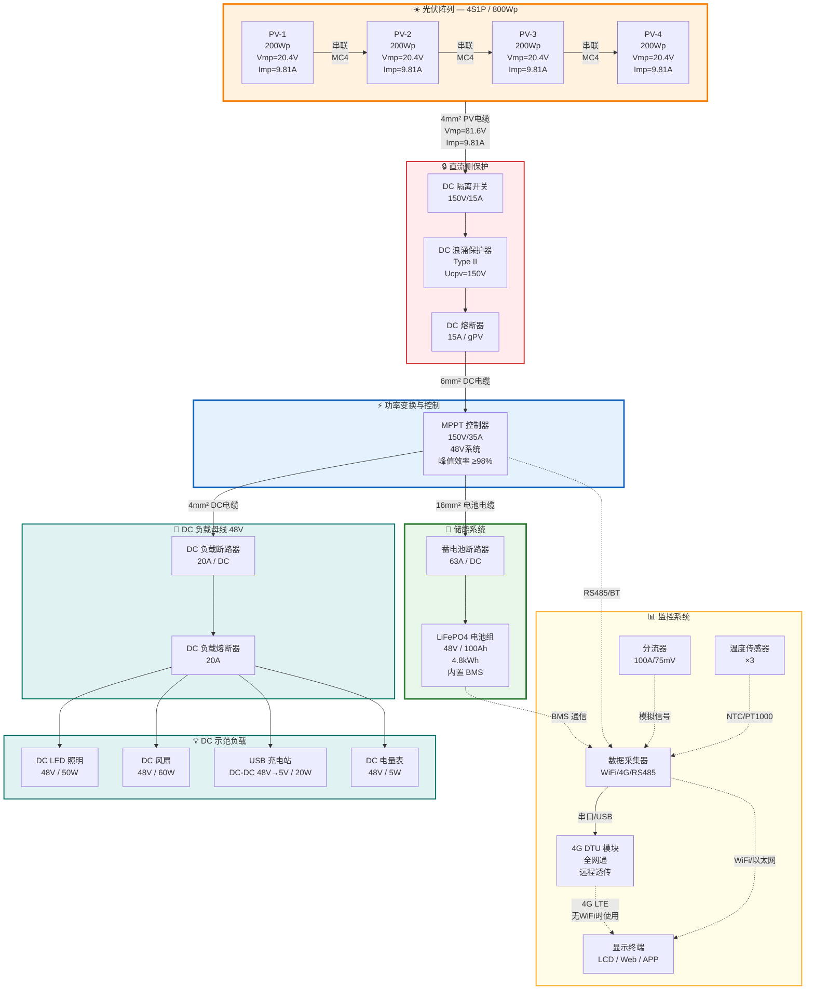

### 3.2 功率流分析

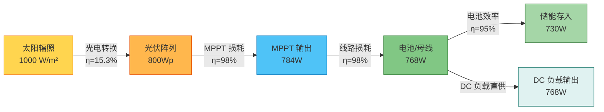

**系统综合效率计算：**

$$\eta_{sys} = \eta_{MPPT} \times \eta_{cable} \times \eta_{battery} = 0.98 \times 0.98 \times 0.95 = 91.2\%$$

---

## 4. 组件选型与技术参数

### 4.1 光伏组件

**选型要求**：单晶硅 PERC 技术，200Wp，36 电池片，12V 标称电压，适合串联至 48V 系统。

| 参数 | 符号 | 数值 | 单位 |
|------|------|------|------|
| 额定最大功率 | P_max | 200 | Wp |
| 最大功率电压 | V_mp | 20.40 | V |
| 最大功率电流 | I_mp | 9.81 | A |
| 开路电压 | V_oc | 24.30 | V |
| 短路电流 | I_sc | 10.86 | A |
| 组件效率 | η_mod | ≥15.3 | % |
| 电池片类型 | — | 单晶硅 PERC | — |
| 电池片数量 | — | 36 (6×6) | 片 |
| 最大系统电压 | V_sys_max | 1000 | V DC |
| 最大串联保险丝额定值 | — | 15 | A |
| 功率温度系数 | γ | -0.37 | %/°C |
| 电压温度系数 | β_Voc | -0.30 | %/°C |
| 电流温度系数 | α_Isc | +0.05 | %/°C |
| NOCT | — | 45±2 | °C |
| 尺寸 (长×宽×高) | — | 1320×992×35 | mm |
| 重量 | — | 11.5 | kg |
| 前板玻璃 | — | 3.2mm 钢化玻璃 | — |
| 边框 | — | 阳极氧化铝合金 | — |
| 接线盒 | — | IP67，3 旁路二极管 | — |
| 连接器 | — | MC4 兼容 | — |
| 引出线 | — | 4mm², 900mm | — |
| 质保 | — | 产品 12 年 / 功率 25 年 | — |

**推荐品牌（任选其一）**：隆基 LONGi Hi-MO 系列、晶科 JinkoSolar Tiger Neo 系列、天合光能 Trina Vertex S 系列、晶澳 JA Solar DeepBlue 系列

### 4.2 MPPT 充放电控制器

**选型依据**：
- PV 输入电压范围需覆盖 Voc_max（极端低温）= 107.4V
- 充电电流需满足 800W ÷ 48V = 16.7A
- 48V 蓄电池系统兼容

| 参数 | 数值 | 单位 |
|------|------|------|
| 型号（参考） | Victron SmartSolar MPPT 150/35 或同等 | — |
| 最大 PV 开路电压 | 150 | V DC |
| 最大 PV 短路电流 | 35 | A |
| 额定充电电流 | 35 | A |
| 蓄电池电压范围 | 12/24/36/48 (自适应) | V |
| MPPT 跟踪效率 | ≥99.5 | % |
| 峰值转换效率 | ≥98 | % |
| 充电算法 | Bulk → Absorption → Float → Equalize | — |
| LiFePO4 预设 | 支持（可编程） | — |
| 通信接口 | 蓝牙 BLE / VE.Direct / RS485 | — |
| 显示 | 内置 LCD + APP 远程 | — |
| 数据记录 | 45天历史数据 | — |
| 防护等级 | IP43 (室内) / IP65 (可选室外壳体) | — |
| 工作温度 | -30 ~ +60 | °C |
| 散热方式 | 自然对流（降额运行） | — |
| 尺寸 | 186 × 95 × 47.5 | mm |
| 重量 | 1.25 | kg |

**LiFePO4 充电参数设置：**

| 充电阶段 | 电压设置 | 说明 |
|----------|----------|------|
| Bulk (恒流) | — | MPPT 最大功率输出，电流由 PV 决定 |
| Absorption (恒压) | 57.6V (3.6V/cell × 16) | 电压上限，电流逐渐减小 |
| Float (浮充) | 54.4V (3.4V/cell × 16) | 维持充满状态 |
| 低电压断开 | 44.8V (2.8V/cell × 16) | 防止过放 |
| 低电压重连 | 49.6V (3.1V/cell × 16) | 恢复供电 |

### 4.3 锂电池储能系统

| 参数 | 数值 | 单位 |
|------|------|------|
| 电池类型 | LiFePO4 (磷酸铁锂) | — |
| 标称电压 | 48 (16S 配置) | V |
| 额定容量 | 100 | Ah |
| 额定能量 | 4.8 | kWh |
| 可用能量 (90% DoD) | 4.32 | kWh |
| 充电电压 | 54.4 ~ 57.6 | V |
| 放电截止电压 | 44.8 | V |
| 最大持续充电电流 | 50 (0.5C) | A |
| 最大持续放电电流 | 100 (1C) | A |
| 峰值放电电流 (3s) | 150 (1.5C) | A |
| 循环寿命 | ≥6000 (80% DoD) | 次 |
| 工作温度(充电) | 0 ~ +55 | °C |
| 工作温度(放电) | -20 ~ +60 | °C |
| 自放电率 | <3 | %/月 |
| BMS 功能 | 过充/过放/过流/短路/温度保护 | — |
| BMS 通信 | RS485 / CAN / 蓝牙 | — |
| 均衡方式 | 主动均衡 | — |
| 防护等级 | IP54 | — |
| 重量 | ~45 | kg |
| 尺寸 (参考) | 520 × 240 × 220 | mm |

**推荐品牌**：派能 Pylontech US5000、比亚迪 B-Box、鹏辉能源 PHT-48100、国轩高科或同等

### 4.4 线缆规格

| 线缆编号 | 用途 | 规格 | 长度(m) | 颜色 | 标准 |
|----------|------|------|---------|------|------|
| C1 | PV 组件串联 | 4mm² PV1-F 双层绝缘光伏电缆 | 4×2 = 8 | 红(+)/黑(-) | EN 50618 / TUV 2PfG |
| C2 | PV 阵列至汇流箱 | 4mm² PV1-F | 2×15 = 30 | 红(+)/黑(-) | EN 50618 |
| C3 | 汇流箱至 MPPT | 6mm² RVV 铜芯 | 2×5 = 10 | 红(+)/黑(-) | GB/T 5023 |
| C4 | MPPT 至蓄电池 | 16mm² BVR 铜芯软线 | 2×2 = 4 | 红(+)/黑(-) | GB/T 5023 |
| C5 | MPPT LOAD 至 DC 负载母线 | 4mm² BVR | 2×3 = 6 | 红(+)/黑(-) | GB/T 5023 |
| C6 | DC 负载母线至各负载 | 2.5mm² BVR 双芯 | 4×3 = 12 | 红(+)/黑(-) | GB/T 5023 |
| C7 | 接地主干线 | 6mm² BVR 黄绿 | 1×10 = 10 | 黄绿 | GB/T 5023 |
| C8 | 设备接地支线 | 4mm² BVR 黄绿 | 5×2 = 10 | 黄绿 | GB/T 5023 |
| C9 | 4G DTU 通信线 | RS485 双绞屏蔽线 RVSP 2×0.5mm² | 1×2 = 2 | 灰 | GB/T 19889 |

---

## 5. 电气设计与计算

### 5.1 光伏阵列电气参数（4S1P 配置）

#### 5.1.1 STC 标准条件参数 (25°C, 1000 W/m², AM1.5)

| 参数 | 单块组件 | 4S1P 阵列 |
|------|----------|-----------|
| V_mp | 20.40 V | **81.60 V** |
| I_mp | 9.81 A | **9.81 A** |
| P_mp | 200 W | **800 W** |
| V_oc | 24.30 V | **97.20 V** |
| I_sc | 10.86 A | **10.86 A** |

#### 5.1.2 温度修正计算

**极端低温 (-10°C)：最大开路电压**

$$V_{oc,max} = V_{oc,STC} \times [1 + \beta_{Voc} \times (T_{min} - T_{STC})]$$

$$V_{oc,max} = 97.2 \times [1 + (-0.003) \times (-10 - 25)]$$

$$V_{oc,max} = 97.2 \times [1 + 0.105] = 97.2 \times 1.105 = \mathbf{107.4\,V}$$

> ✅ 107.4V < MPPT 最大输入 150V，满足要求  
> ✅ 107.4V < IEC 60364 ELV 限值 120V DC，满足超低电压安全等级

**极端高温 (70°C 组件表面)：最低工作电压**

$$V_{mp,min} = V_{mp,STC} \times [1 + \beta_{Voc} \times (T_{max} - T_{STC})]$$

$$V_{mp,min} = 81.6 \times [1 + (-0.003) \times (70 - 25)]$$

$$V_{mp,min} = 81.6 \times [1 - 0.135] = 81.6 \times 0.865 = \mathbf{70.6\,V}$$

> ✅ 70.6V > 蓄电池充电电压 57.6V，MPPT 可正常降压工作

**极端高温短路电流：**

$$I_{sc,max} = I_{sc,STC} \times [1 + \alpha_{Isc} \times (T_{max} - T_{STC})]$$

$$I_{sc,max} = 10.86 \times [1 + 0.0005 \times (70 - 25)] = 10.86 \times 1.0225 = \mathbf{11.10\,A}$$

### 5.2 线缆压降计算

线缆压降公式：

$$\Delta V = \frac{2 \times L \times I \times \rho}{A}$$

其中：L = 单程长度(m)，I = 电流(A)，ρ = 电阻率(0.0175 Ω·mm²/m @25°C)，A = 截面积(mm²)

| 线段 | 截面 (mm²) | 长度 L (m) | 电流 I (A) | ΔV (V) | 参考电压 (V) | ΔV% | 判定 |
|------|-----------|-----------|-----------|--------|-------------|-----|------|
| C2: PV→汇流箱 | 4 | 15 | 9.81 | 1.29 | 81.6 | 1.58% | ✅ <3% |
| C3: 汇流箱→MPPT | 6 | 5 | 9.81 | 0.29 | 81.6 | 0.35% | ✅ |
| C4: MPPT→电池 | 16 | 2 | 16.7* | 0.07 | 48 | 0.15% | ✅ |
| C5: MPPT→DC负载母线 | 4 | 3 | 16.7* | 0.44 | 48 | 0.92% | ✅ |
| C6: DC负载母线→负载 | 2.5 | 3 | 4.2** | 0.18 | 48 | 0.37% | ✅ |

> *MPPT 输出电流：800W × 0.98 ÷ 48V ≈ 16.3A（取 16.7A 计）  
> **单回路 DC 负载电流：~200W ÷ 48V ≈ 4.2A

**DC 侧总压降（PV→MPPT）**: 1.29 + 0.29 = 1.58V，占 Vmp 的 1.94% → ✅ 合格 (<3%)

**DC 负载侧总压降**: 0.44 + 0.18 = 0.62V，占 48V 的 1.29% → ✅ 合格 (<5%)

### 5.3 线缆载流量校验

| 线缆 | 截面 | 设计电流 (A) | 安全系数 (×1.25 IEC) | 所需载流量 (A) | 实际载流量* (A) | 判定 |
|------|------|-------------|----------------------|---------------|----------------|------|
| C2 PV电缆 4mm² | 4mm² | 10.86 (Isc) | 13.58 | 13.58 | 40 | ✅ |
| C3 DC主线 6mm² | 6mm² | 10.86 | 13.58 | 13.58 | 50 | ✅ |
| C4 电池线 16mm² | 16mm² | 16.7 | 20.88 | 20.88 | 100 | ✅ |
| C5 DC负载线 4mm² | 4mm² | 16.7 | 20.88 | 20.88 | 40 | ✅ |
| C6 DC分支线 2.5mm² | 2.5mm² | 4.2 | 5.25 | 5.25 | 26 | ✅ |

> *PV1-F 电缆在自由空气中的载流量，铜导体 @70°C

---

## 6. 系统接线图与连接图

### 6.1 直流侧详细接线图

以下为光伏阵列到 MPPT 控制器的完整直流侧接线：

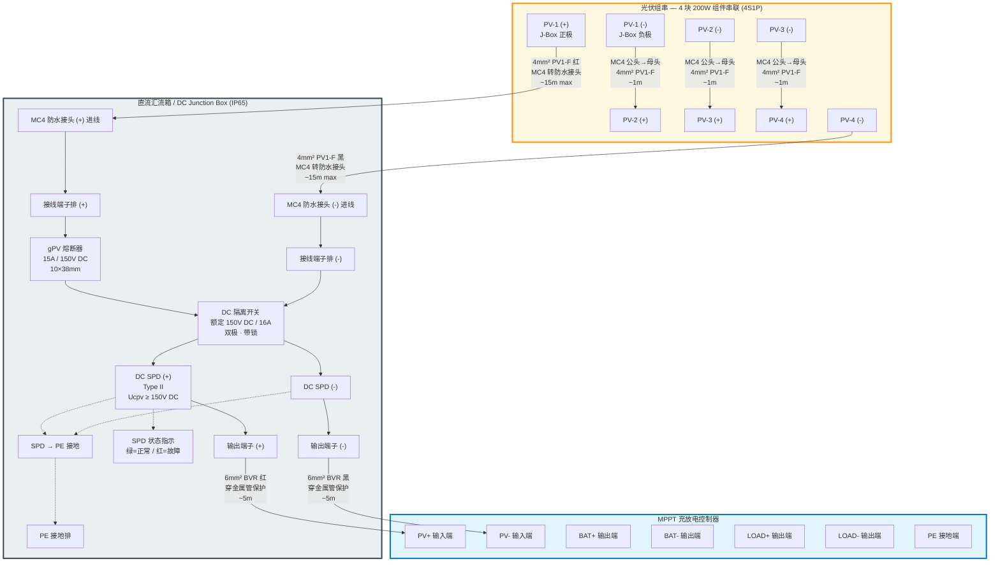

### 6.2 储能侧与 DC 负载母线接线图

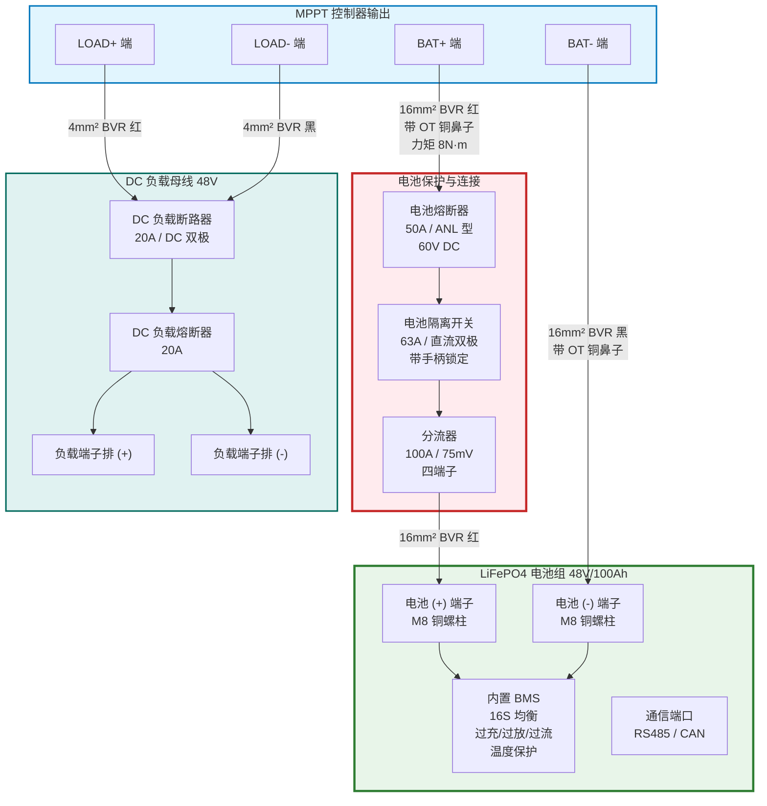

### 6.3 完整系统单线图 (One-Line Diagram)

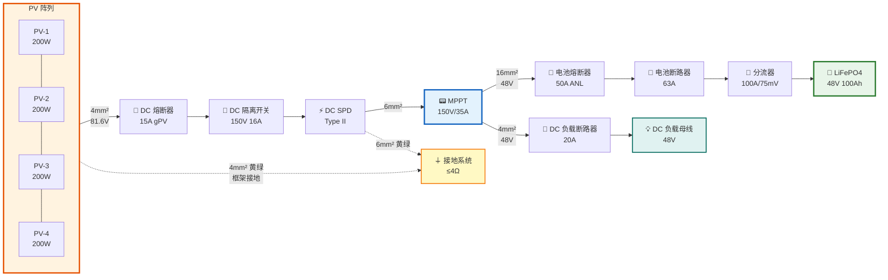

### 6.4 接地系统详图

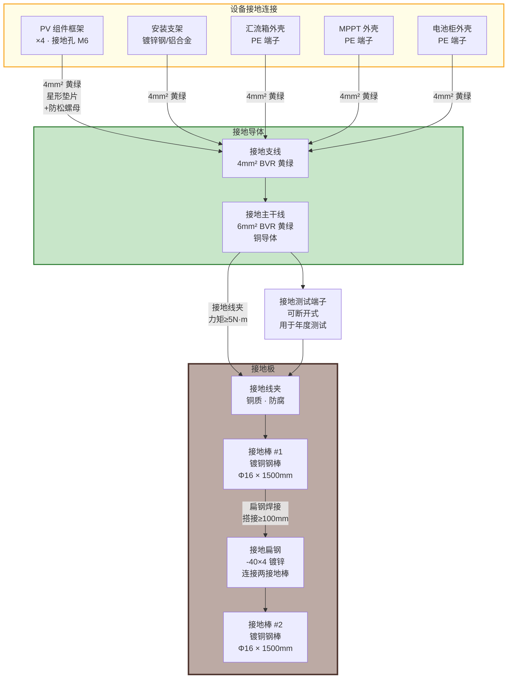

### 6.5 组件物理布局与线缆走向

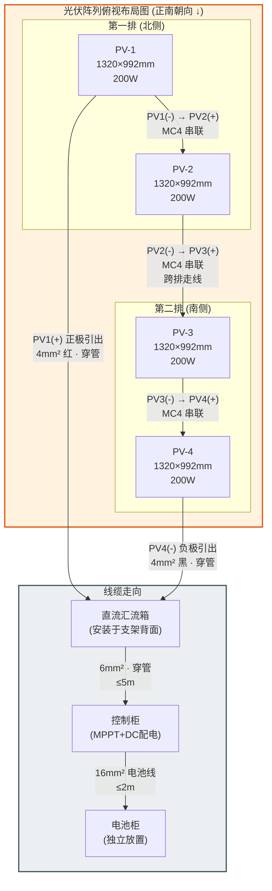

**布局说明**：
- 4 块组件分两排两列安装，竖向放置（长边水平方向）
- 总占地面积：约 2700mm × 2000mm（含间距）
- 组件间距：同排间距 20mm，前后排间距根据冬至日正午无遮挡计算
- 前后排间距公式：$D = H \times \frac{\cos\phi}{\tan(90° - \phi - 23.45°)}$，其中 H 为组件高度差，φ 为当地纬度

---

## 7. 保护系统设计

### 7.1 保护配置总览

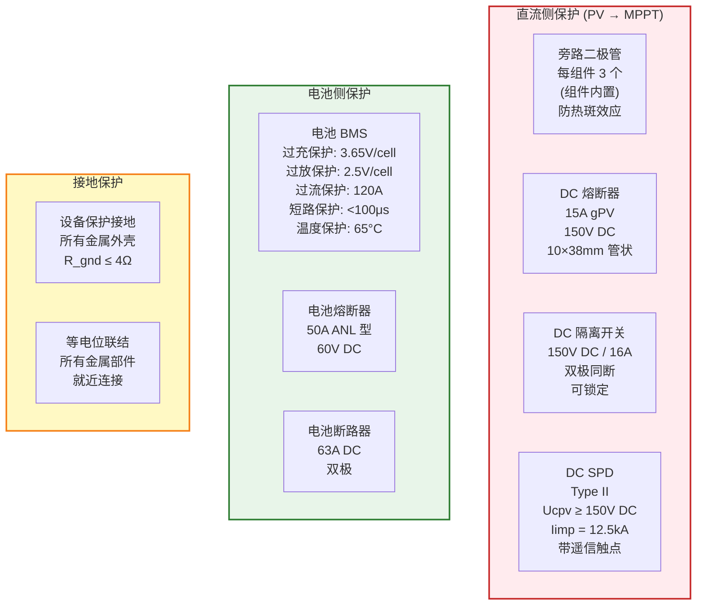

### 7.2 保护整定值一览表

| 保护装置 | 位置 | 额定值 | 动作值 | 动作时间 | 选型依据 |
|----------|------|--------|--------|----------|----------|
| DC 熔断器 | PV→MPPT | 15A / 150V DC | 15A (gPV 特性) | 按熔断特性 | ≥ 1.25×Isc(13.6A)，≤ 组件最大保险丝额定 15A |
| DC 隔离开关 | 汇流箱内 | 16A / 150V DC | 手动操作 | — | ≥ Isc_max = 11.1A |
| DC SPD | 汇流箱内 | Iimp=12.5kA | Up ≤ 1.2kV | <25ns | IEC 61643-31 |
| 电池熔断器 | 电池正极 | 50A / 60V DC | 50A | 按熔断特性 | ≥ MPPT 最大输出 35A × 1.25 = 43.75A |
| 电池断路器 | 电池正极 | 63A DC | 63A | 按脱扣特性 | 配合电池最大放电 100A |
| BMS 过流 | 电池内部 | 120A | 120A | <5ms | 电池内部保护，最后一道防线 |
| DC 负载断路器 | DC 负载母线 | 20A DC | 20A | 按脱扣特性 | 保护 DC 负载回路 |

### 7.3 保护级联配合

保护设备应保证 **选择性**（Selectivity），即故障时仅跳开最近的保护装置：

```
DC 负载断路器 (20A) → 电池断路器 (63A) → BMS 过流保护 (120A)
```

DC 侧保护级联：

```
DC 熔断器 (15A gPV) → MPPT 内部保护 → 电池断路器 (63A) → BMS (120A)
```

选择性要求：下级保护的动作时间/电流应小于上级的不动作值。

---

## 8. 接地与防雷设计

### 8.1 接地系统设计

**接地型式**：TT 系统（电源侧与设备侧各自独立接地）

**接地电阻要求**：R ≤ 4Ω（接触电压远低于安全限值 50V DC）

**接地极配置**：
- 主接地极：2 根镀铜钢棒（Φ16mm × 1500mm），间距 ≥ 3m
- 连接方式：镀锌扁钢 -40×4mm，焊接连接，搭接长度 ≥ 2 倍扁钢宽度（≥ 80mm）
- 埋设深度：接地棒顶部距地面 ≥ 600mm

**等电位联结清单**：

| 序号 | 设备/部件 | 接地导体 | 连接方式 | 力矩要求 |
|------|----------|----------|----------|----------|
| 1 | PV-1 框架 | 4mm² 黄绿 | 星形垫片+螺栓 | 4 N·m |
| 2 | PV-2 框架 | 4mm² 黄绿 | 星形垫片+螺栓 | 4 N·m |
| 3 | PV-3 框架 | 4mm² 黄绿 | 星形垫片+螺栓 | 4 N·m |
| 4 | PV-4 框架 | 4mm² 黄绿 | 星形垫片+螺栓 | 4 N·m |
| 5 | 安装支架 | 4mm² 黄绿 | 接线端子 | 5 N·m |
| 6 | 汇流箱外壳 | 4mm² 黄绿 | PE 端子排 | 2 N·m |
| 7 | MPPT 控制器 | 4mm² 黄绿 | PE 螺柱 | 2 N·m |
| 8 | 电池柜外壳 | 4mm² 黄绿 | PE 端子 | 2 N·m |

### 8.2 防雷措施

本示范电站规模较小（<1kW），采用简化防雷措施：

1. **SPD 保护**：DC 侧安装 Type II SPD
2. **等电位联结**：所有金属部件通过 PE 导体连接至共同接地系统
3. **线缆敷设**：DC 正负极电缆紧贴敷设，减小感应环路面积
4. **避免最高点**：组件阵列不应成为周围区域的最高点

---

## 9. 机械结构与安装设计

### 9.1 支架结构设计

**支架类型**：地面固定式，可调倾角

| 参数 | 规格 |
|------|------|
| 材质 | 热镀锌 Q235B 钢 或 6063-T5 铝合金 |
| 表面处理 | 热镀锌 ≥65μm (钢) / 阳极氧化 ≥15μm (铝) |
| 抗风等级 | ≥ 0.7 kPa (对应风速 ≥ 33 m/s) |
| 倾角范围 | 15° ~ 45° 可调 (每 5° 一档) |
| 基础方式 | 混凝土配重块 (每墩 ≥50kg) 或地脚螺栓 |
| 组件固定 | 压块固定 (中压块 + 边压块) |
| 螺栓规格 | M8 不锈钢 (304 或 316) |

### 9.2 支架结构侧视图

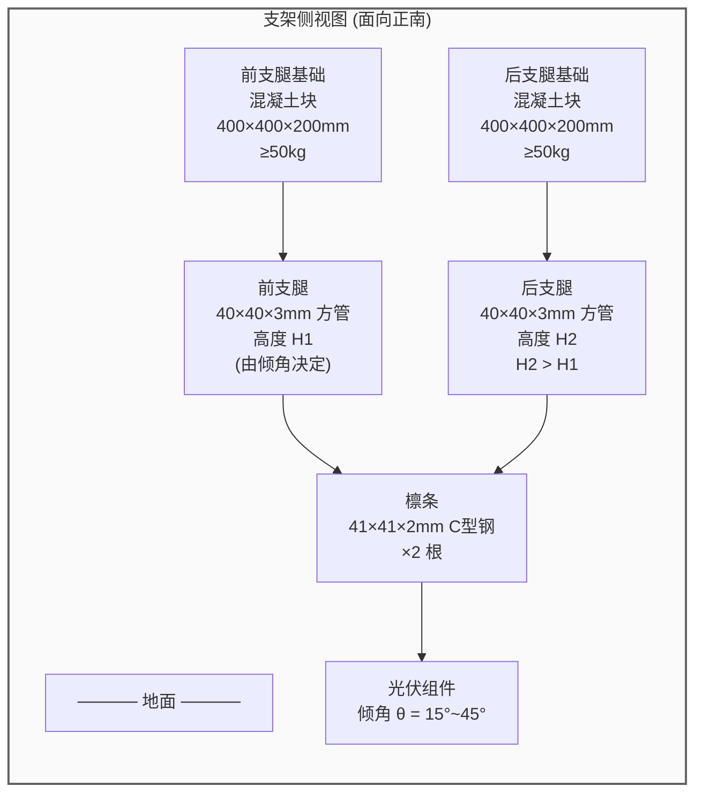

### 9.3 关键安装尺寸

**组件安装间距（以倾角 30° 为例）**：

- 组件安装宽度（竖装，沿倾斜方向）：992mm
- 组件投影高度差：H = 992 × sin30° = 496mm
- 纬度 φ = 35°（以中国中部为例）
- 冬至日太阳高度角：α = 90° - φ - 23.45° = 31.55°
- 前后排最小间距：D = H / tan(α) = 496 / tan(31.55°) = 496 / 0.614 = **808mm**
- 取整并加安全裕量：**D = 1000mm**

---

## 10. 监控与数据采集系统

### 10.1 监控系统架构

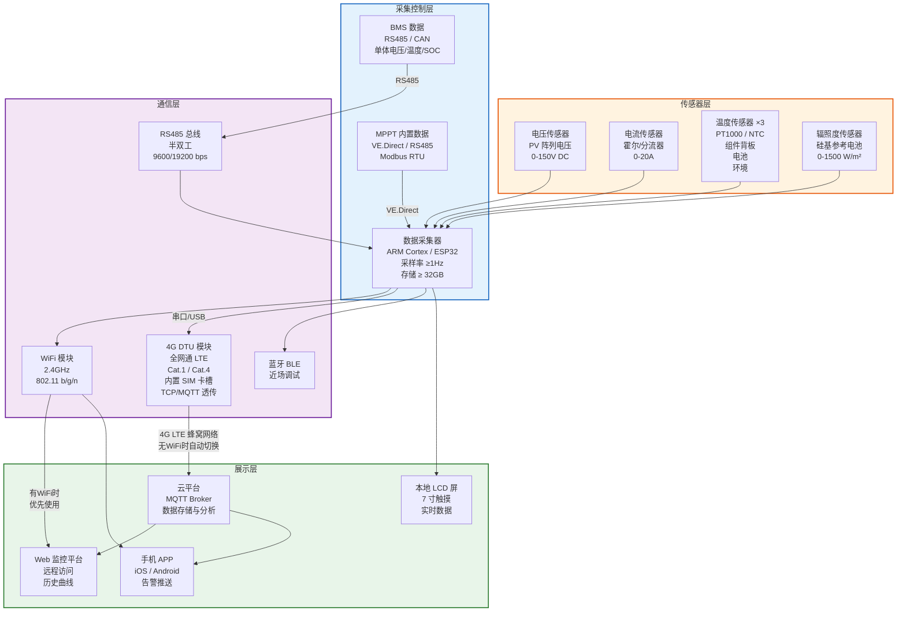

### 10.2 4G DTU 通信模块

为支持在 **无 WiFi 覆盖的偏远场地** 部署电站，系统配置工业级 4G DTU（Data Transfer Unit），通过蜂窝网络实现远程数据上传与设备管理。

#### 10.2.1 4G DTU 技术参数

| 参数 | 数值 | 单位/说明 |
|------|------|-----------|
| 通信制式 | LTE Cat.1 / Cat.4 全网通 | 移动/联通/电信 |
| 频段 | B1/B3/B5/B8/B34/B38/B39/B40/B41 | 覆盖国内全频段 |
| 最大下行速率 | 10 Mbps (Cat.1) / 150 Mbps (Cat.4) | |
| 最大上行速率 | 5 Mbps (Cat.1) / 50 Mbps (Cat.4) | |
| SIM 卡 | Micro SIM / Nano SIM，单卡 | 标准运营商数据卡 |
| 串口接口 | RS485 + RS232 + TTL | 连接数据采集器 |
| 网络协议 | TCP/UDP/MQTT/HTTP/Modbus TCP | |
| 透传模式 | 串口↔网络双向透传 | 对采集器透明 |
| 心跳保活 | 可配置 30s~3600s | 保持在线 |
| 断线重连 | 自动重连，≤30s | |
| 数据缓存 | 断网时本地缓存，恢复后补传 | |
| 供电 | DC 5~36V 宽电压 | 可直接接蓄电池或DC-DC |
| 功耗 | 待机 <15mA / 通信 <200mA @12V | |
| 天线 | 外置 SMA 全向天线，增益 3dBi | 附赠吸盘天线 |
| 防护等级 | IP30 (模块) / IP65 (选配外壳) | |
| 工作温度 | -35 ~ +75 | °C |
| 尺寸 | 90 × 60 × 25 | mm |
| 安装方式 | DIN 导轨 / 螺钉固定 | |

**推荐型号（任选其一）**：有人 USR-G786 / 塔石 DTU-4G01 / 锐谷 RG-200 / 宏电 H7710 或同等

#### 10.2.2 SIM 卡与流量方案

| 方案 | 月流量 | 月费(参考) | 适用场景 |
|------|--------|-----------|----------|
| 物联网专用卡 | 30MB | ~5元/月 | 仅数值数据上报（推荐） |
| 物联网专用卡 | 100MB | ~10元/月 | 数值 + 少量图片/日志 |
| 普通数据卡 | 1GB | ~20元/月 | 含远程固件升级/视频 |

**流量估算**：采集 15 个参数 × 每条约 100 字节 × 每分钟上报 1 次 = 100B × 15 × 60 × 24 ≈ **2.1 MB/天 ≈ 63 MB/月**。推荐选择 100MB/月方案。

#### 10.2.3 通信链路切换策略

系统支持 **WiFi/4G 双链路自动切换**，优先级如下：

```
链路优先级：WiFi (优先) → 4G LTE (备用) → 本地存储 (离线)

切换逻辑：
  ① 上电后优先尝试 WiFi 连接（10s 超时）
  ② WiFi 连接成功 → 通过 WiFi 上传数据
  ③ WiFi 连接失败或断开 → 自动切换至 4G DTU
  ④ 4G 注册成功 → 通过 4G 上传数据
  ⑤ 4G 也不可用 → 数据写入本地 SD 卡缓存
  ⑥ 任一链路恢复 → 自动补传缓存数据
```

#### 10.2.4 4G DTU 接线说明

```
数据采集器                    4G DTU 模块
┌──────────┐                ┌──────────┐
│   RS485 A├───────────────→┤RS485 A   │
│   RS485 B├───────────────→┤RS485 B   │
│      GND ├───────────────→┤GND       │
└──────────┘                │          │
                            │   SMA ◄──┼── 4G 全向天线
蓄电池/DC-DC                 │          │
┌──────────┐                │          │
│  12V DC +├───────────────→┤VIN+      │
│  12V DC -├───────────────→┤VIN-      │
└──────────┘                │          │
                            │ SIM 卡槽 ◄┤── Micro SIM 卡
                            └──────────┘
```

### 10.3 监控数据采集清单

| 序号 | 监测参数 | 传感器类型 | 量程 | 精度 | 采样周期 | 通信方式 |
|------|----------|-----------|------|------|---------|---------|
| 1 | PV 阵列电压 | 电阻分压 | 0~150V DC | ±0.5% | 1s | ADC |
| 2 | PV 阵列电流 | 霍尔传感器 | 0~20A | ±1% | 1s | ADC |
| 3 | PV 功率 | 计算值 (V×I) | 0~1000W | — | 1s | 计算 |
| 4 | 电池电压 | MPPT/BMS 上报 | 0~60V | ±0.5% | 1s | Modbus |
| 5 | 电池电流 | 分流器 100A/75mV | ±100A | ±1% | 1s | ADC |
| 6 | 电池 SOC | BMS 计算 | 0~100% | ±5% | 5s | RS485 |
| 7 | 电池温度 | NTC 10kΩ | -20~+80°C | ±0.5°C | 5s | RS485 |
| 8 | 组件背板温度 | PT1000 | -40~+100°C | ±0.3°C | 10s | ADC |
| 9 | 环境温度 | PT1000 百叶箱 | -40~+60°C | ±0.3°C | 60s | ADC |
| 10 | 辐照度 | 硅基参考电池 | 0~1500 W/m² | ±3% | 10s | ADC |
| 11 | DC 负载电压 | MPPT/分压器 | 0~60V DC | ±0.5% | 1s | ADC |
| 12 | DC 负载电流 | 霍尔传感器 | 0~30A | ±1% | 1s | ADC |
| 13 | DC 负载功率 | 计算值 (V×I) | 0~1500W | — | 1s | 计算 |
| 14 | 系统效率 | 计算值 | 0~100% | — | 60s | 计算 |

---

## 11. 物料清单与采购指南

### 11.1 核心设备清单 (BOM)

| 序号 | 物料名称 | 规格型号 | 数量 | 单位 | 参考单价(¥) | 小计(¥) | 备注 |
|------|----------|----------|------|------|-------------|---------|------|
| **A. 光伏组件** | | | | | | | |
| A1 | 单晶 PERC 光伏组件 | 200Wp, 36 cell, MC4 | 4 | 块 | 350 | 1,400 | 一线品牌 |
| **B. 功率变换** | | | | | | | |
| B1 | MPPT 充放电控制器 | 150V/35A, 48V 系统 | 1 | 台 | 1,800 | 1,800 | Victron 或同等 |
| **C. 储能系统** | | | | | | | |
| C1 | LiFePO4 电池组 | 48V/100Ah, 内置BMS | 1 | 组 | 5,500 | 5,500 | 含通信功能 |
| **D. 电气保护** | | | | | | | |
| D1 | DC 熔断器底座+熔芯 | 10×38, 15A gPV, 150V | 1 | 套 | 45 | 45 | |
| D2 | DC 隔离开关 | 150V/16A, 双极 | 1 | 台 | 85 | 85 | 带锁定手柄 |
| D3 | DC SPD (光伏专用) | Type II, 150V DC | 1 | 台 | 180 | 180 | 带遥信 |
| D4 | 电池熔断器+座 | ANL 50A, 60V DC | 1 | 套 | 60 | 60 | |
| D5 | 电池隔离开关/断路器 | 63A DC, 双极 | 1 | 台 | 120 | 120 | |
| D6 | DC 负载断路器 | 20A DC, 双极 | 1 | 台 | 45 | 45 | |
| D7 | DC 负载熔断器+座 | 20A, 60V DC | 1 | 套 | 30 | 30 | |
| **E. 线缆** | | | | | | | |
| E1 | PV 光伏电缆 | 4mm² PV1-F, 红 | 25 | m | 5 | 125 | TUV认证 |
| E2 | PV 光伏电缆 | 4mm² PV1-F, 黑 | 25 | m | 5 | 125 | TUV认证 |
| E3 | DC 电力电缆 | 6mm² BVR, 红 | 10 | m | 8 | 80 | |
| E4 | DC 电力电缆 | 6mm² BVR, 黑 | 10 | m | 8 | 80 | |
| E5 | 电池连接线 | 16mm² BVR, 红 | 5 | m | 18 | 90 | |
| E6 | 电池连接线 | 16mm² BVR, 黑 | 5 | m | 18 | 90 | |
| E7 | DC 负载主线 | 4mm² BVR, 红/黑 | 6 | m | 5 | 30 | |
| E8 | DC 负载分支线 | 2.5mm² BVR, 红/黑 | 12 | m | 4 | 48 | |
| E9 | 接地线 | 6mm² BVR, 黄绿 | 10 | m | 8 | 80 | |
| E10 | 接地线 | 4mm² BVR, 黄绿 | 10 | m | 5 | 50 | |
| **F. 连接器与端子** | | | | | | | |
| F1 | MC4 连接器 (公+母) | 4mm², IP67 | 4 | 对 | 8 | 32 | 正品 |
| F2 | MC4 转端子适配器 | 4mm² | 2 | 对 | 15 | 30 | |
| F3 | OT 铜鼻子 | 16mm²-M8 | 8 | 个 | 3 | 24 | 镀锡 |
| F4 | OT 铜鼻子 | 6mm²-M6 | 10 | 个 | 2 | 20 | 镀锡 |
| F5 | 接线端子排 | 6mm², DIN导轨 | 10 | 位 | 5 | 50 | |
| F6 | 热缩管套装 | Φ4~Φ25, 各色 | 1 | 套 | 25 | 25 | 双壁含胶 |
| **G. 机柜与箱体** | | | | | | | |
| G1 | DC 汇流箱 | IP65, 壁挂, 200×150×100 | 1 | 台 | 120 | 120 | 不锈钢或ABS |
| G2 | 设备安装柜/架 | 600×400×250, 户外型 | 1 | 台 | 350 | 350 | 放置MPPT+DC配电 |
| G4 | 电池柜 | 600×300×300, 通风型 | 1 | 台 | 280 | 280 | 阻燃材质 |
| **H. 支架与基础** | | | | | | | |
| H1 | 光伏支架套件 | 可调角度, 4板位 | 1 | 套 | 600 | 600 | 含前后腿+檩条+压块 |
| H2 | 混凝土配重块 | 400×400×200, ≥50kg | 4 | 块 | 80 | 320 | 可现场浇筑 |
| H3 | 不锈钢螺栓套装 | M8, 304不锈钢 | 1 | 套 | 60 | 60 | 含垫片弹垫螺母 |
| **I. 接地材料** | | | | | | | |
| I1 | 镀铜接地棒 | Φ16×1500mm | 2 | 根 | 55 | 110 | |
| I2 | 接地扁钢 | -40×4 镀锌 | 4 | m | 12 | 48 | |
| I3 | 接地线夹 | 铜质, Φ16适配 | 2 | 个 | 15 | 30 | |
| I4 | 星形弹垫 | M6, 不锈钢 | 10 | 个 | 1 | 10 | 组件框架接地用 |
| **J. 走线与固定** | | | | | | | |
| J1 | PVC 线管 | Φ25mm, 户外型 | 10 | m | 4 | 40 | |
| J2 | 线管弯头/接头 | Φ25mm | 10 | 个 | 2 | 20 | |
| J3 | 线管固定卡 | Φ25mm | 20 | 个 | 1 | 20 | |
| J4 | 尼龙扎带 | 4.8×300mm, 耐候黑 | 100 | 根 | 0.3 | 30 | UV resistant |
| J5 | 线号管/标签 | 套管式 | 1 | 套 | 25 | 25 | |
| **K. 监控设备** | | | | | | | |
| K1 | 分流器 | 100A/75mV | 1 | 个 | 40 | 40 | |
| K2 | DC 电量表 | 48V, 直流, 带LCD | 1 | 个 | 65 | 65 | DC 负载计量 |
| K3 | 温度传感器 PT1000 | -50~+150°C, 贴片式 | 2 | 个 | 25 | 50 | 组件+环境 |
| K4 | 温度传感器 NTC | 电池用, 防水 | 1 | 个 | 15 | 15 | |
| K5 | 辐照度传感器 | 硅基, 0-1500W/m² | 1 | 个 | 350 | 350 | 可选 |
| K6 | 数据采集器 | WiFi+RS485+LCD | 1 | 台 | 500 | 500 | ESP32 或工业级 |
| K7 | 4G DTU 通信模块 | LTE Cat.1 全网通, RS485, MQTT | 1 | 台 | 280 | 280 | 含天线，无WiFi场景必备 |
| K8 | 物联网 SIM 卡 | 100MB/月流量 | 1 | 张 | 10 | 10 | 年费约120元 |
| K9 | 4G 天线延长线 | SMA 公/母, 3m, RG174 | 1 | 根 | 25 | 25 | 天线引至室外增强信号 |
| **L. DC 示范负载** | | | | | | | |
| L1 | DC LED 灯板 | 48V DC, 50W | 1 | 套 | 80 | 80 | |
| L2 | DC 风扇 | 48V DC, 60W | 1 | 台 | 120 | 120 | |
| L3 | USB 充电站 (DC-DC) | 48V→5V, 4口, 20W | 1 | 台 | 55 | 55 | 内置 DC-DC 降压 |
| L4 | DC 电量显示仪表 | 48V DC, 5W | 1 | 台 | 45 | 45 | |

### 11.2 工具清单（施工所需）

| 工具 | 用途 |
|------|------|
| 万用表 (含钳形电流表) | 电压/电流/通断测量 |
| MC4 专用压接钳 | MC4 连接器压接 |
| 液压端子压接钳 (16mm²) | OT 铜鼻子压接 |
| 热风枪 | 热缩管收缩 |
| 扭力扳手 (可调 2~25 N·m) | 螺栓紧固 |
| 电钻 + 钻头套装 | 支架安装 |
| 活动扳手 (2把) | 螺栓紧固 |
| 内六角扳手套装 | 组件压块安装 |
| 水平仪 / 角度尺 | 支架调平与倾角调整 |
| 卷尺 (5m) | 尺寸测量 |
| 剥线钳 | 线缆剥皮 |
| 接地电阻测试仪 | 接地电阻测量 |
| 绝缘电阻测试仪 (兆欧表, 500V/1000V) | 绝缘测试 |
| 红外测温仪 | 热点检测 |
| 个人防护装备 (PPE) | 安全帽、绝缘手套、安全鞋、护目镜 |

### 11.3 费用汇总

| 类别 | 金额 (¥) | 占比 |
|------|----------|------|
| A. 光伏组件 | 1,400 | 11.5% |
| B. 功率变换设备 | 1,800 | 14.8% |
| C. 储能系统 | 5,500 | 45.2% |
| D. 电气保护 | 565 | 4.6% |
| E. 线缆 | 798 | 6.6% |
| F. 连接器与端子 | 181 | 1.5% |
| G. 机柜与箱体 | 750 | 6.2% |
| H. 支架与基础 | 980 | 8.1% |
| I. 接地材料 | 198 | 1.6% |
| J. 走线与固定 | 135 | 1.1% |
| K. 监控设备 (含4G DTU) | 1,335 | 11.0% |
| L. DC 示范负载 | 300 | 2.5% |
| **合计** | **~12,142** | — |
| 备件与运费 (10%) | ~1,214 | — |
| **总预算** | **~13,356** | **100%** |

---

## 12. 安装施工指南

### 12.1 施工流程总览

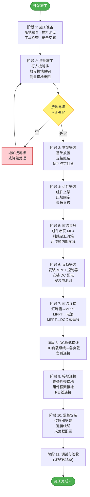

### 12.2 阶段 1：施工准备

#### 12.2.1 场地要求

| 条件 | 要求 |
|------|------|
| 场地面积 | ≥ 4m × 3m (组件阵列区) + 1m × 2m (设备区) |
| 地面条件 | 平坦坚实，排水良好 |
| 遮挡分析 | 9:00~15:00 时段内阵列无阴影遮挡 |
| 朝向 | 正南方向 (偏差 ≤ ±10°) |
| 安全距离 | 距可燃物 ≥ 1m，距水源 ≥ 2m |

#### 12.2.2 物料到场检查清单

- [ ] 核对所有物料数量与型号
- [ ] 光伏组件外观检查（玻璃无裂纹、边框无变形、接线盒完好）
- [ ] 测量各组件 Voc（万用表直测），偏差应 < 3%
- [ ] 线缆绝缘检查（外观无破损）
- [ ] 保护设备铭牌核对
- [ ] 工具完备性检查
- [ ] 安全设备检查（PPE 完好）

### 12.3 阶段 2：接地施工

**操作步骤：**

1. **定位接地棒位置**：距设备柜 ≤ 3m 处，两棒间距 ≥ 3m
2. **打入接地棒**：使用接地棒打入器，垂直打入地面，棒顶距地表 600mm
3. **敷设接地扁钢**：两接地棒之间敷设 -40×4 镀锌扁钢，焊接连接，搭接长度 ≥ 80mm，焊后涂沥青防腐
4. **引出接地主干线**：6mm² 黄绿色 BVR 线，从接地极引至设备安装区域
5. **设置接地测试端子**：在主干线上设置可断开的测试端子，便于年度测量
6. **回填**：用细土回填，夯实，不得使用建筑垃圾回填
7. **测量接地电阻**：使用接地电阻测试仪（三极法或钳形法），记录数值

> **验收标准**：接地电阻 R ≤ 4Ω。若不满足，可增加接地棒数量或使用降阻剂。

### 12.4 阶段 3：支架安装

**操作步骤：**

1. **放置基础配重块**：按照布局图摆放 4 个混凝土块，前排两块间距 = 组件总宽度 + 间隙
2. **安装前后支腿**：用地脚螺栓固定支腿到配重块上，前支腿较低、后支腿较高
3. **安装横向檩条**：两根 C 型钢檩条水平安装于前后支腿顶端
4. **调整倾角**：使用角度尺调整到目标倾角（推荐当地纬度 ±5°），锁紧固定
5. **水平校准**：使用水平仪检查两根檩条的左右水平度
6. **紧固检查**：所有螺栓使用扭力扳手紧固到标定力矩

| 连接位置 | 螺栓规格 | 紧固力矩 |
|----------|----------|----------|
| 支腿与基础 | M12 | 25 N·m |
| 檩条与支腿 | M10 | 15 N·m |
| 压块与檩条 | M8 | 8~10 N·m |

### 12.5 阶段 4：组件安装

**⚠️ 安全警告**：光伏组件在有光照条件下即产生电压（Voc ≈ 24.3V/块），安装过程中注意以下事项：
- 戴绝缘手套操作
- 避免短路组件正负极
- 安装期间可使用不透明覆盖物遮挡组件
- 未完成接线前，勿将组件串联

**操作步骤：**

1. **安装顺序**：从后排（北侧）开始，依次 PV-3 → PV-4 → PV-1 → PV-2，避免踩踏已装组件
2. **放置组件**：将组件放置在檩条上，竖向安装（长边沿东西方向）
3. **安装中压块**：在相邻两块组件之间安装中压块，先不完全拧紧
4. **安装边压块**：在阵列四个边缘安装边压块
5. **对齐调整**：确保所有组件整齐对齐，边缘平齐
6. **最终紧固**：所有压块螺栓紧固至 8~10 N·m
7. **安装接地星形垫片**：在每块组件的接地标识孔处安装星形弹垫 + 接地螺栓

### 12.6 阶段 5：直流接线（组件串联）

**⚠️ 警告**：此步骤完成后，阵列输出电压将达到 ~97V DC，务必断开 DC 隔离开关后再进行后续接线！

**操作步骤：**

1. **组件串联连接**（从后排开始）：

   ```
   串联顺序：PV-1(+) → 引出正极总线 → 汇流箱
              PV-1(-) → MC4连接 → PV-2(+)
              PV-2(-) → MC4连接 → PV-3(+)  ← 跨排走线，穿管保护
              PV-3(-) → MC4连接 → PV-4(+)
              PV-4(-) → 引出负极总线 → 汇流箱
   ```

2. **MC4 连接**：将公头（Male, -极引线）插入母头（Female, +极引线），听到"咔嗒"声确认锁定
3. **跨排走线**：PV-2 到 PV-3 的连接线需跨越排间间距，使用线管保护，扎带固定于支架
4. **正负极引线至汇流箱**：
   - PV-1 的 (+) 引线：4mm² 红色 PV1-F 电缆，穿管引至汇流箱
   - PV-4 的 (-) 引线：4mm² 黑色 PV1-F 电缆，穿管引至汇流箱
   - **正负极电缆紧贴平行敷设**（减小感应环路）
5. **汇流箱内接线**：
   - MC4 转端子适配器接入汇流箱防水接头
   - 正极接入 → 熔断器 → 隔离开关（一极）→ SPD → 输出端子
   - 负极接入 → 隔离开关（另一极）→ SPD → 输出端子
   - SPD 接地端接 PE 排

6. **测试**（隔离开关断开状态）：
   - 测量汇流箱输入端 Voc，应为 ~97V（4 × 24.3V）
   - 与铭牌值偏差 < 5%

### 12.7 阶段 6~7：设备安装与直流连接

**设备安装顺序**：MPPT 控制器 → DC 负载配电 → 电池组

1. **MPPT 控制器安装**：
   - 壁挂安装于设备柜内，垂直方向，散热面朝上
   - 上方保留 ≥ 150mm 散热空间
   - 固定螺栓 M4，紧固力矩 2 N·m

2. **DC 负载配电安装**：
   - DC 负载断路器与熔断器安装于设备柜内 DIN 导轨
   - 距 MPPT ≤ 0.5m，便于接线

3. **电池组安装**：
   - 放置于电池柜内，柜体固定于平整地面
   - 电池柜需通风（自然通风或风扇）
   - 电池与柜体之间用减震垫隔离

4. **直流连接**（确保 DC 隔离开关处于断开状态）：

   **接线顺序严格如下（关键！）**：

   ```
   ① 先接电池侧：MPPT BAT+ → 电池熔断器 → 电池断路器 → 分流器 → 电池(+)
                   MPPT BAT- → 电池(-)
   ② 再接 DC 负载侧：MPPT LOAD+ → DC 负载断路器 → 负载熔断器 → 负载端子排(+)
                       MPPT LOAD- → 负载端子排(-)
   ③ 最后接 PV 侧：汇流箱输出+ → MPPT PV+
                    汇流箱输出- → MPPT PV-
   ```

   > **关键原则**：先接电池（为 MPPT 建立参考电压），再接 PV（有电池后 MPPT 才能正常启动）。**绝不可先接 PV 后接电池**，否则可能损坏 MPPT。

5. **线缆制作**：
   - 16mm² 电池线两端压接 OT 铜鼻子 (M8)，使用液压压接钳
   - 压接后套入双壁热缩管，热风枪收缩密封
   - 6mm² 线两端压接 OT 铜鼻子 (M6)
   - 所有连接端子紧固力矩参考下表

| 端子规格 | 线缆截面 | 紧固力矩 |
|----------|----------|----------|
| M4 | ≤ 4mm² | 1.2 N·m |
| M6 | 4~6mm² | 3.5 N·m |
| M8 | 10~16mm² | 8 N·m |
| M10 | 25mm² | 14 N·m |

### 12.8 阶段 8：DC 负载接线

1. **DC 负载母线至各负载**：
   - 使用 2.5mm² BVR 双芯电缆（红+/黑-）
   - 从 DC 负载端子排引出各回路
   - 穿管保护

2. **DC 负载接线顺序**：
   ```
   负载端子排 (+) → 各 DC 负载正极
   负载端子排 (-) → 各 DC 负载负极
   注意极性：红线为正(+)，黑线为负(-)
   ```

3. **各 DC 负载接线**：
   - DC LED 灯板：直接接 48V DC
   - DC 风扇：直接接 48V DC
   - USB 充电站：内置 DC-DC 模块，输入 48V，输出 5V USB
   - DC 电量表：串联于负载母线，显示电压/电流/功率

### 12.9 阶段 9：接地连接

按照第 8 章等电位联结清单，依次完成所有设备外壳的 PE 连接：
- 组件框架 (×4) → 4mm² 黄绿线 → 接地主干线
- 安装支架 → 4mm² 黄绿线 → 接地主干线
- 汇流箱外壳 → 4mm² 黄绿线 → 接地主干线
- MPPT 控制器外壳 → 4mm² 黄绿线 → 接地主干线
- 电池柜外壳 → 4mm² 黄绿线 → 接地主干线
- 接地主干线 → 接地测试端子 → 接地极

### 12.10 阶段 10：监控系统安装

1. **温度传感器安装**：
   - 组件背板传感器：用铝胶带粘贴于 PV-2 背面中心位置
   - 环境温度传感器：安装于百叶箱或遮阳处
   - 电池温度传感器：贴附于电池外壳表面

2. **分流器接入**：串联于电池正极回路（已在直流接线时完成）

3. **DC 电量表接入**：串联于 DC 负载母线回路

4. **数据采集器配置**：
   - RS485 总线连接 MPPT、BMS
   - 模拟输入连接分流器、温度传感器
   - WiFi 配置连接路由器（若有 WiFi 环境）
   - 设置采样参数与数据上传周期

5. **4G DTU 模块安装与配置**：
   - 将 4G DTU 安装于设备柜内 DIN 导轨或螺钉固定
   - 插入已开通数据流量的 Micro SIM 卡（注意方向，听到卡扣声）
   - RS485 接线：DTU 的 A → 采集器 RS485 A，DTU 的 B → 采集器 RS485 B，GND 对接
   - 供电接线：从 48V 蓄电池经 DC-DC 降压模块（48V→12V）供电至 DTU VIN+/VIN-
   - 安装 4G 天线：旋紧 SMA 接口，若设备柜为金属外壳需将天线通过延长线引至柜外
   - 上电后观察 DTU 指示灯：电源灯常亮 → SIM灯闪烁（搜网）→ 网络灯常亮（注册成功）
   - 通过 DTU 配置工具设置：服务器地址、端口号、MQTT Topic、心跳间隔（建议 60s）、串口参数（与采集器一致：9600/19200, 8N1）
   - 验证数据通路：在云平台确认可收到采集器上报数据

---

## 13. 调试与验收流程

### 13.1 调试流程图

```mermaid
graph TD
    T_START(["开始调试"]) --> T1

    subgraph VISUAL["13.2 外观检查"]
        T1["外观检查<br/>所有连接牢固<br/>极性正确<br/>标识清晰"]
    end

    subgraph INSULATION["13.3 绝缘测试"]
        T2["DC 侧绝缘测试<br/>PV+ 对 PE<br/>PV- 对 PE<br/>PV+ 对 PV-<br/>→ ≥1MΩ (500V DC)"]
    end

    subgraph OCV["13.4 开路电压"]
        T4["PV 阵列 Voc 测试<br/>DC 隔离开关断开<br/>测量值 vs 理论值<br/>偏差 < 5%"]
        T5["电池电压确认<br/>48~54V 正常<br/>BMS 状态正常"]
    end

    subgraph GROUND["13.5 接地测试"]
        T6["接地电阻测试<br/>R ≤ 4Ω<br/>等电位导通测试<br/>R < 0.2Ω"]
    end

    subgraph POWER_ON["13.6 上电调试"]
        T7["电池连接<br/>闭合电池断路器<br/>MPPT 启动自检"]
        T8["PV 接入<br/>闭合 DC 隔离开关<br/>MPPT 开始充电<br/>检查充电参数"]
        T9["DC 负载母线<br/>闭合 DC 负载断路器<br/>检查 48V 输出"]
    end

    subgraph LOAD_TEST["13.7 带载测试"]
        T10["轻载测试<br/>DC LED 灯 50W<br/>测量 DC 电压"]
        T11["半载测试<br/>~100W DC 负载<br/>运行 30 分钟"]
        T12["满载测试<br/>~200W DC 负载<br/>运行 10 分钟<br/>检查温升"]
    end

    subgraph PROTECTION_TEST["13.8 保护动作测试"]
        T14["过载保护测试<br/>DC 负载断路器<br/>过流脱扣验证"]
    end

    subgraph MONITOR_TEST["13.9 监控验证"]
        T15["数据采集验证<br/>各传感器数据正常<br/>通信链路畅通<br/>远程平台可访问"]
    end

    T1 --> T2
    T2 --> T4
    T4 --> T5
    T5 --> T6
    T6 --> T7
    T7 --> T8
    T8 --> T9
    T9 --> T10
    T10 --> T11
    T11 --> T12
    T12 --> T14
    T14 --> T15
    T15 --> T_END(["调试完成<br/>填写验收报告"])

    style T_START fill:#4CAF50,stroke:#2E7D32,color:white
    style T_END fill:#4CAF50,stroke:#2E7D32,color:white
    style VISUAL fill:#FFF3E0,stroke:#E65100
    style INSULATION fill:#FCE4EC,stroke:#C2185B
    style OCV fill:#E3F2FD,stroke:#1565C0
    style GROUND fill:#FFF9C4,stroke:#F9A825
    style POWER_ON fill:#E8F5E9,stroke:#2E7D32
    style LOAD_TEST fill:#F3E5F5,stroke:#6A1B9A
    style PROTECTION_TEST fill:#FFEBEE,stroke:#C62828
    style MONITOR_TEST fill:#E0F7FA,stroke:#00838F
```

### 13.2 外观检查记录表

| 检查项 | 标准 | 结果 | 备注 |
|--------|------|------|------|
| 组件表面 | 无裂纹、碎片、气泡 | □通过 □不通过 | |
| MC4 连接 | 锁定到位，无松动 | □通过 □不通过 | |
| 线缆固定 | 扎带固定，无悬垂 | □通过 □不通过 | |
| 线缆标识 | 两端标号一致 | □通过 □不通过 | |
| 极性标识 | 红(+)黑(-)标识正确 | □通过 □不通过 | |
| 接地连接 | 黄绿线连接可靠 | □通过 □不通过 | |
| 螺栓紧固 | 无松动，力矩达标 | □通过 □不通过 | |
| 设备铭牌 | 清晰可读 | □通过 □不通过 | |
| 警示标签 | "直流高压"标签张贴 | □通过 □不通过 | |

### 13.3 绝缘测试记录

| 测试项 | 测试电压 | 标准值 | 实测值 | 判定 |
|--------|----------|--------|--------|------|
| PV(+) 对 PE | 500V DC | ≥ 1MΩ | ____MΩ | □合格 |
| PV(-) 对 PE | 500V DC | ≥ 1MΩ | ____MΩ | □合格 |
| PV(+) 对 PV(-) | 500V DC | ≥ 1MΩ | ____MΩ | □合格 |
| DC 负载(+) 对 PE | 500V DC | ≥ 1MΩ | ____MΩ | □合格 |
| DC 负载(-) 对 PE | 500V DC | ≥ 1MΩ | ____MΩ | □合格 |

### 13.4 电气参数测试记录

| 测试项 | 理论值 | 允许范围 | 实测值 | 判定 |
|--------|--------|----------|--------|------|
| PV 阵列 Voc | 97.2V | 92.3~107.4V | ____V | □合格 |
| 电池电压 | 48~54V | 44.8~57.6V | ____V | □合格 |
| 接地电阻 | ≤ 4Ω | — | ____Ω | □合格 |
| DC 负载母线电压 | 48V | 44.8~57.6V | ____V | □合格 |
| DC 负载断路器 | 正常闭合 | — | □正常 | □合格 |

### 13.5 上电操作标准顺序（SOP）

```
步骤 1: 确认 DC 隔离开关 → 断开 (OFF)
步骤 2: 确认 DC 负载断路器 → 断开 (OFF)
步骤 3: 闭合电池断路器 → MPPT 通电自检 → 等待 30s
步骤 4: 检查 MPPT 显示 → 电池电压正常 → 无故障代码
步骤 5: 闭合 DC 隔离开关 → PV 电压接入 MPPT
步骤 6: 检查 MPPT 显示 → PV 电压正常 → MPPT 开始充电
步骤 7: 记录充电电压、电流、功率
步骤 8: 闭合 DC 负载断路器 → DC 负载母线供电
步骤 9: 测量 DC 负载母线电压 → 应为 48V±5%
步骤 10: 逐个接入 DC 负载 → 监控系统运行参数
```

---

## 14. 运维手册与故障排查

### 14.1 日常巡检清单（建议每周一次）

| 检查项 | 方法 | 合格标准 |
|--------|------|----------|
| 组件表面 | 目视 | 无遮挡物、无严重污染 |
| 组件完整性 | 目视 | 玻璃无碎裂 |
| 接线盒 | 目视 + 测温 | 无烧焦变色，温升 < 30K |
| 线缆 | 目视 | 无破损、无啮咬痕迹 |
| 支架 | 目视 + 手摇 | 无松动、无锈蚀 |
| MPPT 显示 | 读数 | 无故障代码 |
| 电池 SOC | 读数 | 20% ~ 100% |
| DC 负载断路器 | 目视 | 正常闭合，无过热 |
| 汇流箱 | 目视 | 箱门关闭，SPD 指示绿色 |

### 14.2 定期维护计划

| 维护项 | 周期 | 内容 |
|--------|------|------|
| 组件清洁 | 每季度 | 清水冲洗（避免高压水枪），清晨或傍晚进行 |
| 螺栓紧固复查 | 半年 | 全部螺栓复紧 |
| 接地电阻测量 | 每年 | 断开测试端子测量，记录趋势 |
| 绝缘电阻测量 | 每年 | DC 侧绝缘测试 |
| 红外热成像 | 每年 | 检测热斑、虚接 |
| SPD 状态检查 | 每年 | 确认指示窗为绿色 |
| 电池均衡检查 | 半年 | BMS 报告单体电压偏差 < 50mV |
| 通风/散热检查 | 半年 | 清理散热通道 |
| 数据备份 | 每月 | 导出历史数据 |

### 14.3 故障排查指南

| 故障现象 | 可能原因 | 排查步骤 | 解决措施 |
|----------|----------|----------|----------|
| MPPT 不充电 | DC 隔离开关断开 | 检查隔离开关位置 | 闭合开关 |
| | DC 熔断器熔断 | 检查熔断器状态 | 查明原因后更换 |
| | PV 阵列电压异常 | 断开后测量 Voc | 检查 MC4 连接 |
| | MPPT 故障 | 查看错误代码 | 联系厂商 |
| DC 负载无供电 | DC 负载断路器断开 | 检查断路器状态 | 排除过载后重合 |
| | 电池电压过低 | 检查 SOC | 等待充电或检查电池 |
| | MPPT LOAD 输出关闭 | 检查 MPPT 低压断开设置 | 充电恢复后自动重连 |
| 发电量偏低 | 组件表面脏污 | 目视检查 | 清洁组件 |
| | 遮挡 | 检查阴影 | 清除遮挡物 |
| | 组件老化/PID | I-V 曲线测试 | 联系厂商 |
| | 天气因素 | 查看辐照度记录 | 正常现象 |
| 电池 SOC 不上升 | BMS 保护触发 | 查看 BMS 状态 | 排除故障后复位 |
| | 电池老化 | 容量测试 | 必要时更换 |
| | 负载过大 | 检查负载功率 | 减小负载 |
| 系统过温告警 | 环境温度过高 | 测量环境温度 | 改善通风 |
| | 散热通道阻塞 | 检查散热口 | 清理散热通道 |
| SPD 指示红色 | SPD 已动作损坏 | 检查 SPD 指示 | 更换 SPD 模块 |

---

## 15. 性能预测与经济分析

### 15.1 发电量预测

**基本公式：**

$$E_{day} = P_{rated} \times PSH \times \eta_{sys} \times (1 - \lambda_{degrad})$$

| 参数 | 含义 | 取值 |
|------|------|------|
| P_rated | 额定功率 | 0.8 kWp |
| PSH | 等效峰值日照小时 | 4.0 h/day (年均) |
| η_sys | 系统综合效率 | 91.2% |
| λ_degrad | 衰减系数 | 0% (首年) |

$$E_{day} = 0.8 \times 4.0 \times 0.912 = 2.92 \text{ kWh/day}$$

| 时间尺度 | 发电量 | 备注 |
|----------|--------|------|
| 日均 | 2.92 kWh | 年均值 |
| 月均 | 87.5 kWh | |
| 年发电量 | 1,066 kWh | 首年 |
| 25年累计 | ~24,800 kWh | 考虑年衰减 0.55% |

### 15.2 能量自给分析

假设示范负载日均用电 2.0 kWh：

| 指标 | 数值 |
|------|------|
| 日发电量 | 2.92 kWh |
| 日用电量 | 2.00 kWh |
| 自给率 | 146% |
| 电池可储存 | 4.32 kWh (90% DoD) |
| 阴雨天自主供电 | ~2.2 天 (4.32÷2.0) |

### 15.3 经济性指标

| 指标 | 数值 | 计算方法 |
|------|------|----------|
| 系统总投资 | ~13,356 元 | BOM 总计 |
| 单瓦成本 | 16.7 元/Wp | 总投资 ÷ 0.8kWp |
| 年发电量 | 1,066 kWh | |
| 度电成本 (LCOE, 25年) | 0.54 元/kWh | 总投资 ÷ 累计发电量 |
| 年节省电费 | ~640 元 | 按 0.6 元/kWh |
| 简单投资回收期 | ~20.9 年 | 总投资 ÷ 年节省 |

> 注：本系统为示范/教学用途，经济性非首要设计目标。规模化应用时成本将大幅降低。

---

## 16. 附录

### 附录 A：线缆标识规范

所有线缆两端必须套装线号管，标识规则如下：

| 线缆编号 | 标识内容 | 示例 |
|----------|----------|------|
| C2-PV+ | PV 正极引线 | `PV-STR1-P` |
| C2-PV- | PV 负极引线 | `PV-STR1-N` |
| C3-DC+ | DC 主正线 | `DC-MAIN-P` |
| C3-DC- | DC 主负线 | `DC-MAIN-N` |
| C4-BAT+ | 电池正线 | `BAT-P` |
| C4-BAT- | 电池负线 | `BAT-N` |
| C5-LOAD+ | DC 负载正线 | `DC-LOAD-P` |
| C5-LOAD- | DC 负载负线 | `DC-LOAD-N` |
| C7 | 接地主干 | `GND-MAIN` |
| C8-x | 接地支线 | `GND-PV1` / `GND-MPPT` 等 |

### 附录 B：安全警示标识

需在以下位置张贴标准安全标识：

| 标识内容 | 张贴位置 | 数量 |
|----------|----------|------|
| ⚡ 警告：直流高压 ≤110V | 汇流箱门内侧 | 1 |
| ⚡ 警告：光照产生电压，无法完全断电 | 光伏阵列旁 | 1 |
| ⚡ 警告：直流 48V | DC 负载配电处 | 1 |
| 🔋 警告：锂电池 勿短路/挤压/火烧 | 电池柜门 | 1 |
| ⏚ 接地标识 | 接地端子旁 | 4 |
| 操作规程 / 紧急联系方式 | 设备柜门内侧 | 1 |

### 附录 C：MPPT 控制器参数设置清单

| 参数项 | 设置值 | 说明 |
|--------|--------|------|
| 电池类型 | LiFePO4 (用户自定义) | 选择锂铁磷预设 |
| 吸收电压 (Absorption) | 57.6V (3.60V × 16) | 充电电压上限 |
| 浮充电压 (Float) | 54.4V (3.40V × 16) | 维持电压 |
| 均衡电压 (Equalize) | 禁用 | LiFePO4 不需要均衡充电 |
| 低电压断开 (LVD) | 44.8V (2.80V × 16) | 防过放 |
| 低电压重连 (LVR) | 49.6V (3.10V × 16) | 恢复供电 |
| 温度补偿 | 0 mV/°C/cell | LiFePO4 不需要温补 |
| 最大充电电流 | 35A (或电池限制值) | |
| 尾电流 (Tail Current) | 2A | 判定充满的电流阈值 |

### 附录 D：紧急操作程序

**紧急停机顺序：**

```
① 断开 DC 负载断路器
② 断开 DC 隔离开关
③ 断开电池断路器

⚠️ 注意：即使完成以上所有操作，光伏组件在有光照时仍有电压！
切勿触摸 PV 阵列输出端或 MC4 连接器！
```

**火灾应急：**

```
① 立即执行紧急停机
② 使用 CO2 或干粉灭火器（禁止用水！）
③ 保持安全距离 ≥ 5m
④ 拨打 119
⑤ 告知消防人员：现场有直流电压（约 100V）和锂电池
```

### 附录 E：验收签字页

| 项目 | 日期 | 负责人 | 签字 |
|------|------|--------|------|
| 施工完成确认 | ____年__月__日 | ________ | ________ |
| 外观检查合格 | ____年__月__日 | ________ | ________ |
| 绝缘测试合格 | ____年__月__日 | ________ | ________ |
| 接地测试合格 | ____年__月__日 | ________ | ________ |
| 上电调试合格 | ____年__月__日 | ________ | ________ |
| 带载运行合格 | ____年__月__日 | ________ | ________ |
| DC 保护动作测试 | ____年__月__日 | ________ | ________ |
| 监控系统正常 | ____年__月__日 | ________ | ________ |
| **总体验收** | ____年__月__日 | ________ | ________ |

---

*文档编制完成。本设计书涵盖了 800Wp 光伏示范电站从设计、选型、采购、施工、接线、调试到运维的全部内容，可作为实际工程实施的完整依据。*

---

**版本记录**

| 版本 | 日期 | 修改内容 | 编制人 |
|------|------|----------|--------|
| V1.0 | 2026-04-08 | 初始发布 | — |
